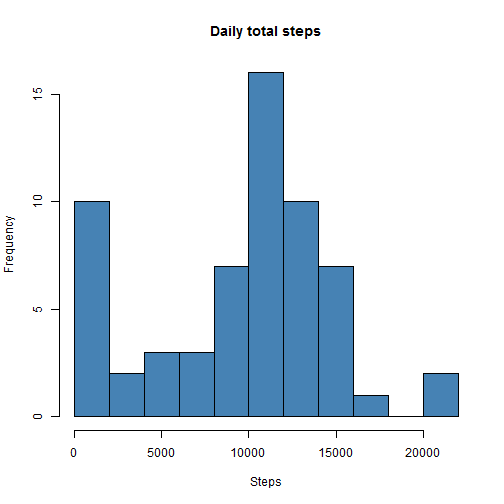
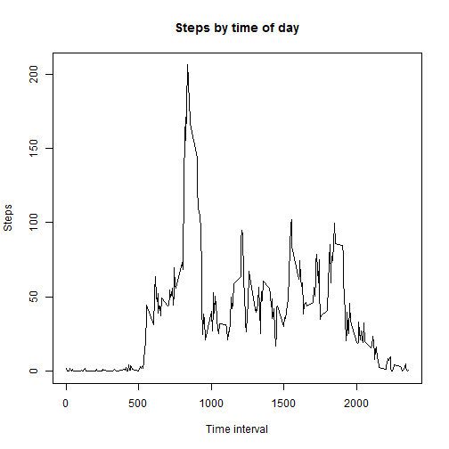
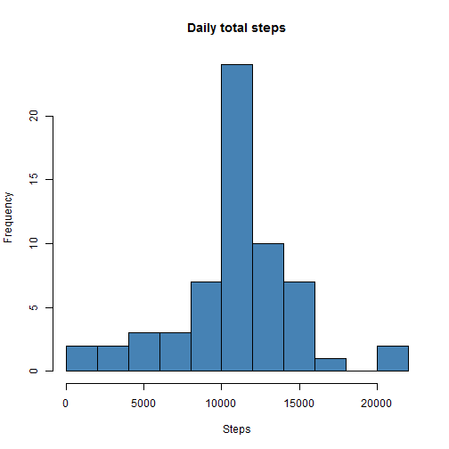

## Loading and preprocessing the data

Create a temprorary file, download the zip file from the course web site, storing in the temporary file, and extract to a data frame. Remove the temporary file.


```r
temp <- tempfile()
download.file("https://d396qusza40orc.cloudfront.net/repdata%2Fdata%2Factivity.zip",temp)
activity <- read.csv(unz(temp,"activity.csv"))
unlink(temp)
```

Transform *date* and *interval* fields to create new POSIXct *datetime* field, convert date field to Date class.


```r
activity$datetime <- as.POSIXct(strptime(paste(activity$date, sprintf("%04d", activity$interval)), format="%Y-%m-%d %H%M"))
activity$date <- as.Date(activity$date)  
```


## What is mean total number of steps taken per day?


To summarise the data by day we use the dplyr package.


```r
require(dplyr)
activityDaily <- summarise(group_by(activity, date), sum(steps, na.rm=TRUE))
colnames(activityDaily)<- c("date", "steps")
```

> 1. Make a histogram of the total number of steps taken each day


```r
hist(activityDaily$steps, breaks=8, xlab="Steps", main="Daily total steps", col = "steelblue")
```

 

> 2. Calculate and report the **mean** and **median** total number of steps taken per day


```r
paste("Mean steps: ", mean(activityDaily$steps))
```

```
## [1] "Mean steps:  9354.22950819672"
```

```r
paste("Median steps: ", median(activityDaily$steps))
```

```
## [1] "Median steps:  10395"
```


## What is the average daily activity pattern?

Create another data frame that contains the average steps per interval.


```r
activityByInterval <- summarise(group_by(activity, interval), mean(steps, na.rm=TRUE))
colnames(activityByInterval)<- c("interval", "steps")
```

> 1. Make a time series plot (i.e. `type = "l"`) of the 5-minute interval (x-axis) and the average number of steps taken, averaged across all days (y-axis)


```r
plot(activityByInterval$interval, activityByInterval$steps, type="l", main="Steps by time of day", xlab="Time interval", ylab="Steps")
```

 

> 2. Which 5-minute interval, on average across all the days in the dataset, contains the maximum number of steps?


```r
maxStepInterval <- arrange(activityByInterval,desc(steps))[1,1]
paste("The 5-minute interval with the maximum number of steps on average across all days is ",maxStepInterval)
```

```
## [1] "The 5-minute interval with the maximum number of steps on average across all days is  835"
```


## Imputing missing values

> 1. Calculate and report the total number of missing values in the dataset


```r
sum(is.na(activity))
```

```
## [1] 2304
```

> 2. Devise a strategy for filling in all of the missing values in the dataset.

Strategy adopted is to substitute the mean for the 5-minute interval across all days for individual missing values. 

> 3. Create a new dataset that is equal to the original dataset but with the missing data filled in.


```r
colnames(activityByInterval) <- c("interval", "stepsAverage")
activityModified <- left_join(activity, activityByInterval)
```

```
## Joining by: "interval"
```

```r
activityModified <- mutate(activityModified,
          stepsModified = ifelse(is.na(steps), stepsAverage, steps)
          )
```

> 4. Make a histogram of the total number of steps taken each day and Calculate and report the **mean** and **median** total number of steps taken per day. Do these values differ from the estimates from the first part of the assignment? What is the impact of imputing missing data on the estimates of the total daily number of steps?


```r
activityModifiedDaily <- summarise(group_by(activityModified, date), sum(stepsModified))
colnames(activityModifiedDaily)<- c("date", "steps")
hist(activityModifiedDaily$steps, breaks=8, xlab="Steps", main="Daily total steps", col = "steelblue")
```

 

```r
paste("Mean steps: ", mean(activityModifiedDaily$steps))
```

```
## [1] "Mean steps:  10766.1886792453"
```

```r
paste("Median steps: ", median(activityModifiedDaily$steps))
```

```
## [1] "Median steps:  10766.1886792453"
```

These values differ from the first part of the assignment.

The impact of imputing missing data on the estimates of the total daily number of steps is to remove most of the days previously showing no steps.

## Are there differences in activity patterns between weekdays and weekends?

> 1. Create a new factor variable in the dataset with two levels -- "weekday" and "weekend" indicating whether a given date is a weekday or weekend day.


```r
activityModified <- mutate(activityModified,
          dayType = ifelse(weekdays(activity$date)=="Saturday"|weekdays(activity$date)=="Sunday", "weekend", "weekday")
          )
```

> 2. Make a panel plot containing a time series plot (i.e. type = "l") of the 5-minute interval (x-axis) and the average number of steps taken, averaged across all weekday days or weekend days (y-axis). 


```r
activityModifiedByInterval <- summarise(group_by(activityModified, dayType, interval), mean(stepsModified))
colnames(activityModifiedByInterval) <- c("dayType", "interval", "steps")
```


```r
require(lattice)
```

```
## Loading required package: lattice
```

```r
xyplot(steps ~ interval | dayType, data=activityModifiedByInterval, layout=c(1,2), type="l", xlab="Interval", ylab="Number of steps")
```

 
