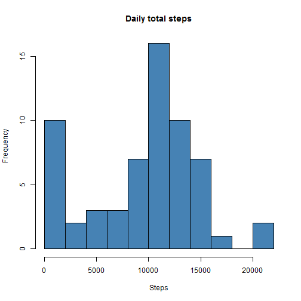

## Loading and preprocessing the data


```r
# Create a temprorary file, download the zip file from the course web site,
# store data in the temporary file, and extract to a data frame. Remove the temporary file.

temp <- tempfile()
download.file("https://d396qusza40orc.cloudfront.net/repdata%2Fdata%2Factivity.zip",temp)
activity <- read.csv(unz(temp,"activity.csv"))
unlink(temp)

# Transform date and interval fields to create new POSIXct
# datetime field, convert date field to Date class.

activity$datetime <- as.POSIXct(strptime(paste(activity$date, sprintf("%04d", activity$interval)), format="%Y-%m-%d %H%M"))
activity$date <- as.Date(activity$date)  
```


## What is mean total number of steps taken per day?


```r
require(dplyr)
activityDaily <- summarise(group_by(activity, date), sum(steps, na.rm=TRUE))
colnames(activityDaily)<- c("date", "steps")
hist(activityDaily$steps, breaks=8, xlab="Steps", main="Daily total steps", col = "steelblue")
```

 

```r
paste("Mean steps: ", mean(activityDaily$steps))
```

```
## [1] "Mean steps:  9354.22950819672"
```

```r
paste("Median steps: ", median(activityDaily$steps))
```

```
## [1] "Median steps:  10395"
```


## What is the average daily activity pattern?


```r
activityByInterval <- summarise(group_by(activity, interval), mean(steps, na.rm=TRUE))
colnames(activityByInterval)<- c("interval", "steps")
plot(activityByInterval$interval, activityByInterval$steps, type="l", main="Steps by time of day", xlab="Time interval", ylab="Steps")
```

 

```r
maxStepInterval <- arrange(activityByInterval,desc(steps))[1,1]
paste("The 5-minute interval with the maximum number of steps on average across all days is ",maxStepInterval)
```

```
## [1] "The 5-minute interval with the maximum number of steps on average across all days is  835"
```


## Imputing missing values


```r
missingValues <- sum(is.na(activity))
paste("There are ", missingValues, " missing values")
```

```
## [1] "There are  2304  missing values"
```


Strategy adopted for filling in all of the missing values in the dataset is to substitute the mean for the 5-minute interval across all days for individual missing values. 


```r
colnames(activityByInterval) <- c("interval", "stepsAverage")
activityModified <- left_join(activity, activityByInterval)
```

```
## Joining by: "interval"
```

```r
activityModified <- mutate(activityModified,
          stepsModified = ifelse(is.na(steps), stepsAverage, steps)
          )
```


```r
activityModifiedDaily <- summarise(group_by(activityModified, date), sum(stepsModified))
colnames(activityModifiedDaily)<- c("date", "steps")
hist(activityModifiedDaily$steps, breaks=8, xlab="Steps", main="Daily total steps", col = "steelblue")
```

 

```r
paste("Mean steps: ", mean(activityModifiedDaily$steps))
```

```
## [1] "Mean steps:  10766.1886792453"
```

```r
paste("Median steps: ", median(activityModifiedDaily$steps))
```

```
## [1] "Median steps:  10766.1886792453"
```

These values differ from the first part of the assignment.

The impact of imputing missing data on the estimates of the total daily number of steps is to remove most of the days previously showing no steps.

## Are there differences in activity patterns between weekdays and weekends?


```r
activityModified <- mutate(activityModified,
          dayType = ifelse(weekdays(activity$date)=="Saturday"|weekdays(activity$date)=="Sunday", "weekend", "weekday")
          )
activityModifiedByInterval <- summarise(group_by(activityModified, dayType, interval), mean(stepsModified))
colnames(activityModifiedByInterval) <- c("dayType", "interval", "steps")
require(lattice)
xyplot(steps ~ interval | dayType, data=activityModifiedByInterval, layout=c(1,2), type="l", xlab="Interval", ylab="Number of steps")
```

 
